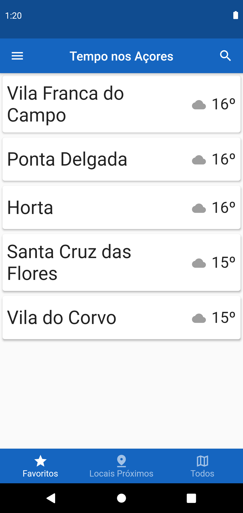
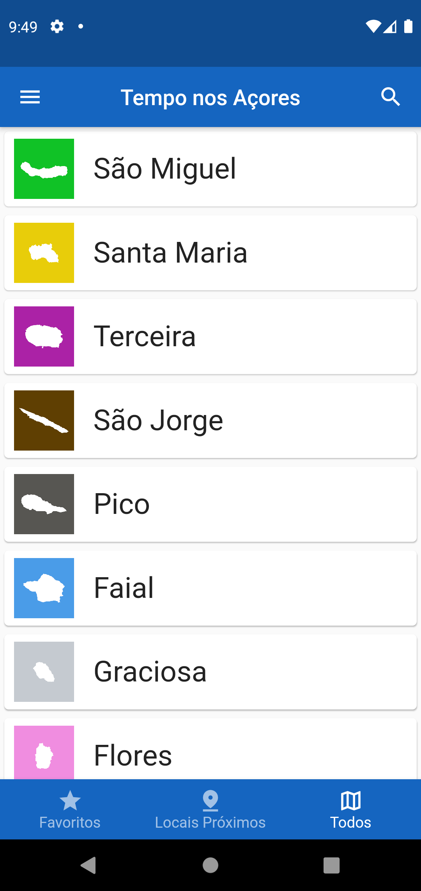

# app-azores-weather
 Weather App for some locations of the Azores in flutter
 Using Clean Architecture, Test Driven Development and BLoC

## Features:
- Check the weather for favourite locations
- Check the weather for all the locations in the Azores
- Add/Remove locations to your favourites
- Check the weather for near locations (TODO)
- Search for locations (TODO)
- Settings (TODO)

  
  

  
  

